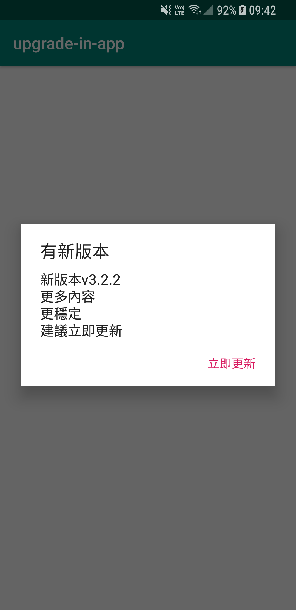
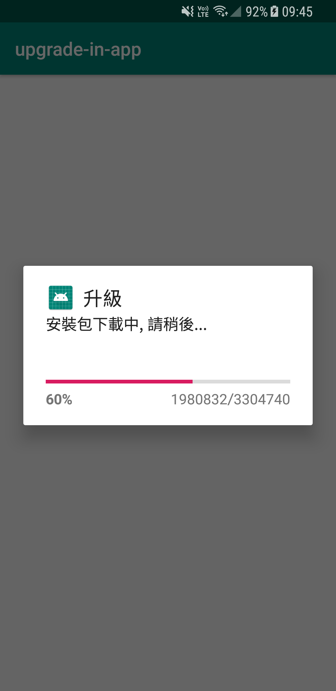
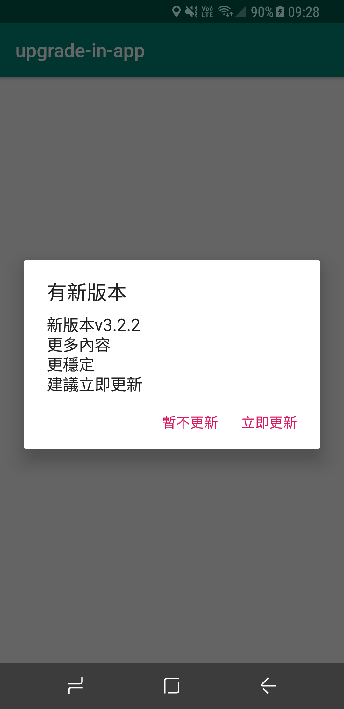
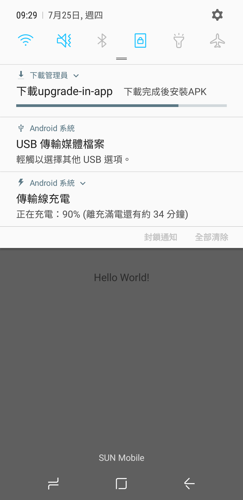

# upgrade_in_app Gradle with jitpack 
==================================================

# Features
- Force upgrade in app
- Flexible upgrade with DownloadManager API
- Force and flexible upgrade with Play core API for Android 5.0 or later

# Screenshot
<table>
  <tr>
    <td width="30%">
      <h3>Force upgrade</h3>
      (Upgrade in app) 
      
      
    </td>
    <td width="30%">
      <h3>Flexible/background upgrade</h3>
      (DownloadManager API) 
      
      
    </td>
    <td width="30%">
      <h3>Force and flexible upgrade with play store</h3>
      (Play core API) Android 5.0 above 
      
      
    </td>
  </tr>
</table>

==================================================
How to Usage:

Step 1. Add the JitPack repository to your build file

Add it in your root build.gradle at the end of repositories:

	allprojects {
		repositories {
			...
			maven { url 'https://jitpack.io' }
		}
	}

Step 2. Add the dependency

	dependencies {
	        implementation 'com.github.zorouyang:upgrade_in_app:0.1'
	}

==================================================
